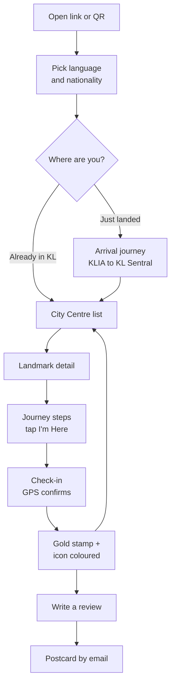
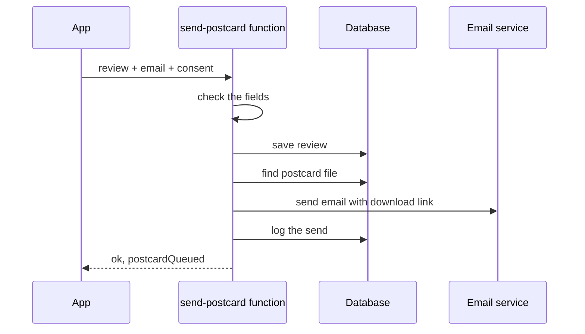
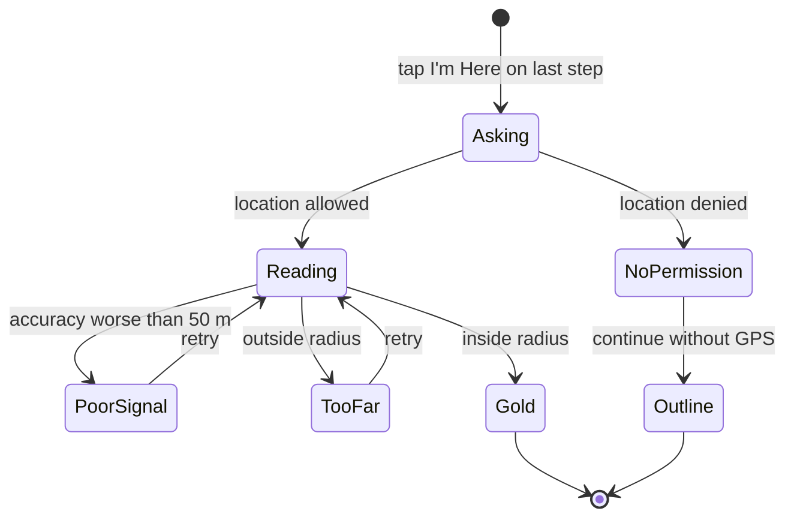
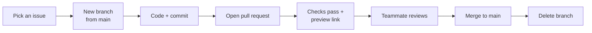

# JalanKL MVP — Development Plan

2026-09-18 · @Someone

## 0. Current status (read this first)

This section says what is done, what each person builds next, and anything that changed from the plan below. It only works if everyone keeps it current.

> **Rule: every pull request updates this section.** Before you commit, update **your own block** below:
> 1. Move finished tasks to **Done** and write what you are building **Next**.
> 2. Add one line to **your push log**: date, task ID, what changed.
> 3. If you changed something the others use (a function in `core/`, a text key, a data shape in `data/`, a route, a shared component), add a line to **Changes from the plan** below, saying what it is and who needs it.
>
> Only edit your own block, so two pull requests rarely touch the same lines. If you still get a merge conflict in this file, keep both sides. The reviewer checks this section before approving (see section 13).

> **Merge into `main`, not into another branch.** When a pull request is built on top of another (stacked), GitHub may set its base to that other branch. Check the line "wants to merge … into `main`" before you click Merge. If it says another branch, click **Edit** next to the title and change the base to `main`. Code merged anywhere else does not reach the live site. (This happened on 2026-09-18 and hid a day of screens.)

**Where we are (2026-09-18):** Phase 0 is done for Faris and Syakir. It is finished for everyone when Danial's D1 and D2 are merged. The live site and a preview link for every pull request work.

### Faris (core and backend)

**Done:** F1 setup, F2 hosting and preview links, F3 fakes, F4 real progress, F5 Settings and languages, F6 real GPS (merged; outdoor phone test to confirm), F7 check-in rules, Check-in screen and debug menu, F11 install to phone and offline, F12 privacy page and consent tick box.

**Waiting (postponed by Faris):** F8 Supabase. The SQL and `npm run check:supabase` are merged; the Supabase project itself is not created yet (steps in `supabase/README.md`). Done when the check prints "All blocked". Until then reviews stay fake.

**Done since:** real GPS and check-in on the live site and preview links (`.env.production`), and a fix for a check-in loop (see change 46).

**Next:** F6 outdoor test on the live site, then F9 send-postcard function (needs an email service account and a sending address; adds a `postcard_place_id` column for Danial's postcard choice), then F10 connect the Review screen to it.

**Before launch (blockers):**
- Pick the team's contact email for data requests and put it in `src/core/privacy.js` (now `TBC`, and the Privacy page says "coming soon").
- Delete reviews older than 12 months automatically (the Privacy page promises it).
- Have someone qualified check the privacy and consent wording (`privacy.*` and `consent.*` in the language files). This is not legal advice (section 9).

**Push log**

| Date | Pull request | What changed |
| --- | --- | --- |
| 2026-09-18 | F1 F3 first commit | Project setup, folders, fake functions, 3 tabs |
| 2026-09-18 | #1 F4 | Real progress saving with tests. `loadSampleProgress()` helper |
| 2026-09-18 | #2 F2 | Cloudflare deploy config (`wrangler.jsonc`) |
| 2026-09-18 | #3 F5 | Translations (react-i18next), Settings screen, `getLanguages()`, placeholder Privacy page |
| 2026-09-18 | Plan status | Added this section 0 |
| 2026-09-18 | App shell | App.jsx uses `<BottomTabs />`; sample page moved to `/debug/components` |
| 2026-09-18 | F6 | Real GPS: best-of-3 `getPosition()`, `watchPosition()`, `getPermissionState()`, `LocationExplainer`, `/debug/location` test page |
| 2026-09-18 | F7 | Real check-in rules with `too_soon`, Check-in screen at `/checkin/:id` with all states, debug menu at `/debug` |
| 2026-09-18 | Welcome route | `/welcome` route (full screen, no tabs) for Syakir's S2. This per-person status layout and the pull request checklist |
| 2026-09-18 | F11 | Install to phone (vite-plugin-pwa), offline app shell, placeholder icons, install hint after a gold stamp |
| 2026-09-18 | F12 | Real Privacy page (PDPA: what, why, who, how long, rights, contact TBC), `<ConsentCheckbox />` for the Review form, test that all languages have the same keys |
| 2026-09-18 | F8 | Supabase SQL for the 3 tables and private `postcards` bucket, lock-down (RLS on, public key revoked), `npm run check:supabase`, setup guide in `supabase/README.md` |
| 2026-09-18 | Integrate screens | One pull request bringing Syakir's S2–S7 (`guide/s7-map`) and Danial's D3, D8, D9, D12 (`rewards/passport`) into `main`. Their earlier pull requests had not reached `main`: Syakir's were stacked and open, and Danial's #13–#15 were merged into each other's branches. Resolved clashes in App.jsx (routes) and PLAN.md (change numbers). OK'd Danial's test libraries and `postcardPlaceId` |
| 2026-09-18 | Welcome redirect | First-open check moved from Guide home into App.jsx, so all three tabs send a new visitor to `/welcome`; shared links still open directly. Test that loads the whole app (`src/App.test.jsx`) |
| 2026-09-18 | Real GPS | `VITE_USE_MOCKS` per part; live site and previews use real GPS and check-in (only reviews stay fake). Fixed the Check-in screen checking in again and again. Tests for both |

### Syakir (guide and map)

**Done:** S1 shared components (Button, Card, StampBadge, Avatar, BottomTabs) and the sample page at `/debug/components`. S2 Welcome screen at `/welcome`. S3 Guide home. S4 Landmark detail. S5 Journey screen. S6 Arrival screen. S7 Map screen (no street tiles yet, see change 30).

**In progress:** S8 colour unlock.

**Next:** S9 Learn, S10 phone polish. S11 field-test fixes waits for Danial's test day (D13).

**Notes from Faris:** S2 saves choices with `setPrefs({ lang, nationality, startedFrom })` and lists languages with `getLanguages()`. When S2 works, ask Faris to add the "first open goes to /welcome" redirect in App.jsx (it will use `startedFrom` being empty).

**Push log**

| Date | Pull request | What changed |
| --- | --- | --- |
| 2026-09-18 | #4 S1 | Shared Button, Card, StampBadge, Avatar, BottomTabs and sample page |
| 2026-09-18 | S3 cleanup | Guide tab back to a placeholder. The S1 sample page stays at `/debug/components` |
| 2026-09-18 | S2 | Welcome screen: language, nationality picker, start choice, all saved with `setPrefs()` |
| 2026-09-18 | S3 | Guide home: landmark list, distance sorting, stamp status. Route `/place/:id` added |
| 2026-09-18 | S4 | Landmark detail: photo, story, hours, "Take me there", outline stamp on open. Route `/journey/:routeId` added |
| 2026-09-18 | S5 | Journey screen: step checklist with icons, saved step, "I'm Here" opens the check-in on the last step |
| 2026-09-18 | S6 | Arrival screen at `/arrival`: recommended way large, others small. "Just landed" on Welcome now goes here. Routes `/arrival` and `/learn` added |
| 2026-09-18 | S7 | Map tab: all 7 landmarks in their real positions, live position, tap to open. No street tiles and no tilt yet |

### Danial (rewards and content)

**Done:** D1 `places.json` (7 spots, desk-checked coordinates and sources) and `data/index.js`. D2 `en.json` / `ms.json` with keys for all 12 screens. D4 stories and hours notes. D5 12 route cards. D6 arrival options and Learn content. D12 landmark icons. D3 Passport screen. D8 Review screen (two steps). D9 Postcard sent. Facts come from desk research; exits, photos and ride times stay TBC for the field day (D7).

**In progress:** nothing. Waiting for review of the open pull requests.

**Next:** D10 hire the photographer, D11 postcard template, D7 field day (fills the TBCs), D13 field test.

**Notes from Faris:** thanks for the coordinates: check-in now works at all 7 landmarks. Please confirm them and `radius_m` on the field day. For D8, use `<ConsentCheckbox checked={consent} onChange={setConsent} />` from `core/ConsentCheckbox.jsx` and keep the send button disabled until it is ticked; you can try it in the debug menu at `/debug`. Please check the Malay in `privacy.*` and `consent.*`.

**Notes from Danial:** research findings that change assumptions are in `src/data/README.md` (Merdeka 118 renamed and mostly closed; Sultan Abdul Samad reopened; Rapid KL gates don't take bank cards yet; KL Tower is a long uphill walk). The Malay still needs a native speaker's read, including Faris's `privacy.*` and `consent.*`.

**Push log**

| Date | Pull request | What changed |
| --- | --- | --- |
| 2026-09-18 | D1 D2 D4 D5 D6 | All data: places, routes, arrival, learn, lines, nationalities, both language files, data tests |
| 2026-09-18 | D12 | 14 landmark icons (grey + colour) in `public/landmarks/` |
| 2026-09-18 | D3 | Passport screen: postage-stamp grid, counts, filters, next stamp, install hint after a gold stamp; screen tests |
| 2026-09-18 | D8 D9 | Review in two steps (stars + text, then choose one postcard + email + consent), Postcard sent screen, 3 routes in App.jsx; screen tests |
| 2026-09-18 | Journey details | Route at a glance, coloured line badges, ride strip map, landmark icon, "What locals say" box (hidden until tips are added) |

### Changes from the plan below (read before coding)

Add new lines at the end. Say who needs to know.

1. **Progress and settings are always real.** `progress.js` and `settings.js` save on the phone (localStorage) even when `VITE_USE_MOCKS=true`. The switch now only picks fake or real for `location.js`, `checkin.js` and `api.js`. **Update:** the switch now works per part, see change 45.
2. **Sample stamps for building screens:** while `npm run dev` is running, type `jalankl.loadSampleProgress()` in the browser console. `jalankl.resetProgress()` clears them. Every core and data function is on `window.jalankl` for testing.
3. **`resetProgress()` keeps preferences** (language, nationality). It clears stamps, journeys and reviews.
4. **A gold stamp keeps its first date.** Checking in again does not change it.
5. **New function `getLanguages()`** in `core/settings.js` returns `[{ code: 'en', name: 'English' }, { code: 'ms', name: 'Bahasa Melayu' }]`, one entry per file in `locales/`.
6. **Showing text:** `const { t } = useTranslation()` from `react-i18next`, then `t('ui.takeMeThere')`. The language switches everywhere when `setPrefs({ lang })` is called. Missing Malay text falls back to English.
7. **New keys in the language files:** `meta.languageName`, `ui.comingSoon`, `ui.openSettings`, `ui.back`, `settings.*` and `privacy.*`. Keep them when editing `en.json` and `ms.json`.
8. **Routes that exist now:** `/`, `/map`, `/passport`, `/settings`, `/privacy`, `/checkin/:id`, `/welcome`, and the hidden `/debug`, `/debug/location` and `/debug/components`. `App.jsx` is Faris's file. When your screen needs a route, add the one line in your pull request and ask Faris to review it.
9. **Settings is opened from the ⚙ button** at the top of the tab screens, not from a tab.
10. **Checks on every pull request:** lint, formatting, tests (`npm test`) and build. Run `npm run format`, `npm run lint` and `npm test` before opening one. Each pull request gets a Cloudflare preview link to try on a phone.
11. **Hosting** is Cloudflare, set up by `wrangler.jsonc`. Do not rename or delete that file.
12. **The bottom tab bar is `shared/BottomTabs.jsx`** (Syakir). App.jsx uses it, so change the tabs there, by pull request.
13. **Two new location functions (F6)** in `core/location.js`: `watchPosition(callback)` for a live position on Map and Guide home (returns a stop function; GPS pauses by itself when the app is hidden), and `getPermissionState()` which answers `granted`, `prompt`, `denied` or `unknown`. See section 8.
14. **`getPosition()` takes up to 3 readings in about 10 seconds** and returns the most accurate. For a quick rough position (for example sorting the Guide list), use `getPosition({ readings: 1 })`.
15. **`distanceTo()` returns `null`** when a place's coordinates are still TBC. Screens must handle that (for example, show no distance and sort by `order`).
16. **Use `<LocationExplainer />`** from `core/LocationExplainer.jsx` before asking for location. It shows the "why we need your location" sentence and an Allow button, shows nothing if location is already allowed, and explains how to turn it on if denied. New text keys: `location.*`.
17. **Hidden developer page `/debug/location`** shows live GPS, accuracy and distance to a test point. English only, not linked in the app.
18. **Check-in has a 6th result, `too_soon`** (F7): a gold less than 2 minutes after a gold at another landmark is refused (the "impossible jumps" rule). `checkIn()` also returns `distance_m` and `accuracy_m` when known. See section 8.
19. **Opening check-in:** the last Journey step ("I'm Here" on a step with `checkinPlace`) should go to `/checkin/<placeId>`, for example `navigate('/checkin/petronas')`. The Check-in screen does the rest, including the location explainer and the outline stamp when location is off. (Syakir, S5.)
20. **A place with no coordinates yet** (still TBC) answers `error` without asking for GPS. Danial: check-in only works once `coords` are filled in `places.json`.
21. **Debug menu at `/debug`** (hidden): force any Check-in state, load or reset sample stamps, and links to the other test pages. Forced states never save anything.
22. **`/welcome` is a full-screen page** (no top bar, no tabs). Other first-open or full-screen pages can use the same layout; ask Faris for the route.
23. **App icons are placeholders** (F11) in `public/icons/`: `icon-192.png`, `icon-512.png`, `icon-maskable-512.png` (logo inside the middle 80%, because phones crop it to a circle) and `apple-touch-icon.png` (180×180). Syakir or Danial: make the real ones at these exact names and sizes.
24. **The app works offline after the first visit** (F11). When you add big images later (landmark photos, signage), tell Faris: large files may need to be left out of the offline copy.
25. **`<InstallHint />`** from `core/InstallHint.jsx` shows "Keep your stamps safe: add to home screen". It is on the Check-in gold screen now. The Passport screen (D3) could show it too. New text keys: `install.*`.
26. **`<ConsentCheckbox />`** (F12) from `core/ConsentCheckbox.jsx` is the consent tick box for the Review form: unticked to start, plain sentence, link to `/privacy` (opens in a new tab so the review is not lost). Danial, D8.
27. **New automatic test: every language file must have exactly the same keys as `en.json`, and no empty text.** If you add a key to one language, add it to the other in the same pull request, or the checks go red.
28. **Data helpers return copies, and `"TBC"` comes back as `null`** (D1). Screens can check `if (place.coords)` or `if (step.photo)` without comparing to the string "TBC". `isTBC(value)` is there if you need it. (Everyone.)
29. **New data helpers** in `src/data/index.js`: `getRoutesTo(placeId)`, `getLearnTopic(id)`, `getLines()`, `getLine(id)` (name and colour for each rail line), `getPostcards()`, `getPostcardPreview(placeId)` and `getNationalities()` (ISO codes; show names with `Intl.DisplayNames`). (Syakir.)
30. **New data fields:** places have `hoursKey`. Route `board` steps have `line`, `lineColour`, `towards`, `at`; `ride` steps have `stops` and `alightAt`. Arrival options have `mode` (`train`/`bus`/`car`), `whyKey`, `tagKey`, `payKey`, `priceShortKey`. Learn topics can hold a `{ "type": "lines" }` block: draw the list from `getLines()` there. (Syakir.)
31. **Arrival option ids are real now:** `klia-ekspres` (recommended, route `klia__kl-sentral`), `klia-transit`, `airport-bus`, `e-hailing`. Their text is under `arrivalOptions.<id>.*`, and `arrival.*` holds the Arrival screen's own labels. (Syakir.)
32. **Visiting order changed:** KL Sentral 1, Merdeka 118 2, Petaling Street 3, Sultan Abdul Samad 4, Petronas 5, KLCC Park 6, KL Tower 7. The route cards follow it, so Merdeka Square → Petronas is one card. KLCC Park → KL Tower is a `car` card (the walk is 17–25 minutes uphill). (Everyone.)
33. **Every place has coordinates now** (desk-checked from Wikipedia/OpenStreetMap, to confirm on the field day), so check-in works at all 7. Two core tests used Petronas as "a place with no coordinates"; they now use a made-up place instead. (Faris.)
34. **Text keys added** for every screen (`welcome.*`, `arrival.*`, `guide.*`, `place.*`, `journey.*`, `map.*`, `learn.*`, `passport.*`, `review.*`, `postcard.*`, `postcardPick.*`, `categories.*`, `lines.*`) plus `meta.dateLocale` for dates, and `ui.stamp.none` / `ui.stamp.outline` / `ui.stamp.gold` ("No stamp", "Outline stamp", "Gold stamp") for `StampBadge` labels. The `welcome.*` keys use the names Syakir's S2 screen already asks for (`welcome.title`, `welcome.intro`, `welcome.language.title`, `welcome.nationality.title` / `.hint` / `.placeholder` / `.skip`, `welcome.start.title` / `.arrival` / `.arrivalHint` / `.city` / `.cityHint`), so its English defaults are replaced by the real text in both languages once both are merged. For a nationality list, use `getNationalities()` with `Intl.DisplayNames` for the country names (no keys needed). Faris's keys are unchanged. Use them instead of adding your own where they fit. (Syakir.)
35. **`prefs.nationality` is an ISO 3166 country code** (S2), for example `JP`, not a country name. The Welcome picker fills it from `getNationalities()` and shows names with `Intl.DisplayNames`, so country names need no translation file. Danial: send the code to `submitReview({ nationality })`, and use the same `Intl.DisplayNames` trick if a screen has to show it.
36. **First open goes to `/welcome`** (S2; moved into `App.jsx` by Faris). Any tab (`/`, `/map`, `/passport`) sends a visitor who has not answered "Where are you right now?" to `/welcome`, using Syakir's `isWelcomeDone()`. Pages opened from a shared link (`/place/:id`, `/checkin/:id`, `/privacy`, `/settings`) open directly. `GuideHomeScreen.jsx` no longer has its own check.
37. **The Map tab has no street tiles and no tilt yet** (S7). MapLibre GL JS needs a hosted tile service, and picking one is still an open question (section 16), so the Map screen draws the seven landmarks from their own coordinates: right positions, no streets. Tilting that drawn map in CSS squashed the icons to about 30px tall, under the 44px a thumb needs, so it is flat. Faris: when the team picks a tile service, `MapScreen.jsx` is the only file that changes, and adding `maplibre-gl` to package.json needs your say-so. The plan already lists the tilt as the first thing to cut (section 12).
38. **The database is locked to the app** (F8). The app never reads or writes Supabase tables directly, not even with the public key: everything goes through `submitReview()` in `core/api.js` (F10). New tables must get the same lock-down, see `supabase/README.md`.
39. **Landmark icons are in** (D12): `public/landmarks/<id>-grey.png` and `<id>-colour.png`, 256 × 256 with a transparent background, anchored at the bottom centre (the ground shadow sits at y ≈ 238). Use `place.iconGrey` / `place.iconColour`. The landmark photos (`place.photo`) come later from the photographer (D10). (Syakir, for the Map.)
40. **New dev-only test libraries (OK'd by Faris):** `jsdom`, `@testing-library/react`, `@testing-library/dom` and `@testing-library/jest-dom`, so screen tests can render a screen and click it. Nothing ships to phones. A test file opts in with `// @vitest-environment jsdom` on its first line, so the other tests still run in plain Node. (Faris, Syakir.)
41. **The review has two steps** (D8). `/review/:id` asks for stars and text. `/review/:id/postcard` lets the visitor choose **one** postcard, from places they have a **gold** stamp for (the others are shown locked), then asks for email and consent (Faris's `<ConsentCheckbox />`; the send button stays disabled until it is ticked) and sends. Then `/postcard/<chosen place>`. The three routes are added in `App.jsx` under the page layout. (Faris, please review those lines.)
42. **`submitReview()` gets one more field: `postcardPlaceId`** (agreed by Faris; the `reviews` table gets a matching column in F9). It is the place whose postcard the visitor chose, or `null` when they have none unlocked yet (the review is still saved). The backend (F9, F10) should email **that** postcard, not always the reviewed place's. It should answer `{ ok: false, reason: 'invalid_postcard' }` if the id is not a postcard place. The server can't check the gold stamp (stamps live on the phone), so the screen enforces it. Other reasons the screen understands: `invalid_email`, `no_consent`, `rate_limited`; anything else shows "we'll try again" and keeps the form filled. (Faris.)
43. **Journey screen shows the route at a glance** (Danial, in Syakir's screen: Syakir, please review). Under the title: every leg in one row (Walk → coloured line badge + stops → Walk → the landmark's icon). Board steps show the line as a badge in its own colour (`LineBadge`, readable on the light Monorail green); ride steps show a strip map from the boarding station to the stop you get off at. New files: `src/guide/components/LineBadge.jsx`, `RouteSummary.jsx`, `RideStops.jsx`, `LocalTips.jsx`, `src/guide/routeLegs.js` (with tests). `JourneyScreen.jsx` only gains the lines that place them. (Syakir.)
44. **Route cards have `localTips`** (Danial): `[{ "textKey": "routes.<routeId>.tips.<n>", "by": "Danial" }]`, text in every language file. The Journey screen shows them as "What locals say" and hides the box while a route has none. **Only real tips from real locals, with their first name. Never write one on someone's behalf.** How to add one: `src/data/README.md`, "Adding a local tip". New text keys: `journey.atAGlance`, `journey.localsSay`, `journey.localsSayHint`, `journey.localBy`. (Everyone: add your own tips!)
45. **The live site now uses real GPS and real check-in** (Faris). `VITE_USE_MOCKS` can list the parts that stay fake: `true` (all), `false` (none), or e.g. `api`. The live site and every preview link read `.env.production` (`VITE_USE_MOCKS=api`): real location and check-in, fake review sending until F10. Your own `.env` can stay `true`, so check-in still gives gold at your desk. Testing a real check-in now means being at the landmark (or use the debug menu's forced states). The debug menu at `/debug` shows which parts are fake. (Everyone.)
46. **`getPlace()` returns a new copy every call** (since D1), so never put its result straight into a `useEffect` or `useCallback` dependency list: the effect would run on every render. Use `useMemo(() => getPlace(id), [id])`, like `PlaceScreen.jsx` does. This caused the Check-in screen to check in again and again with real GPS; fixed. (Everyone.)

## 1. MVP on a page

JalanKL is a phone web app that guides a first-time tourist from KLIA into KL, around six City Centre landmarks, and rewards real visits with stamps and postcards. We build it from scratch in about 4 weeks with 3 people.

The bet: tourists will follow one clear recommended route (not a list of options), tap "I'm Here" at each step, and come back for the stamp and postcard.

| In the MVP | Not in the MVP |
| --- | --- |
| Arrival journey: KLIA to KL Sentral | 3D mini city (we use a tilted 2D map instead) |
| City Centre: 6 landmarks + KL Sentral as check-in spots | Automatic route finder (we hand-write route cards) |
| Hand-written route cards with "I'm Here" steps | Login and accounts |
| One recommended option per route, plus "Open in Google Maps" | Live train times |
| GPS-confirmed check-in, gold and outline stamps | Languages beyond English and Malay |
| Landmark icon turns from grey to colour on the map | Printed or posted postcards |
| Review form, then postcard sent by email (3 landmarks first) | Partner rewards, audio guides, itinerary builder |
| Transit basics pages (Touch 'n Go, line colours, signage photos) | Other neighbourhoods |
| Nationality picker and neutral silhouette avatar | Custom mascot |
| English and Malay | Gender and other profile questions |
| Installable from a link or QR code | App store release |

**Done means:** a first-time visitor with a mid-range Android phone or an iPhone can open the link at KLIA, follow the steps to KL Sentral, travel to Petronas Twin Towers, check in there, get a gold stamp, see the icon coloured on the map, submit a review, and receive the postcard by email. The stamp is still there after closing and reopening the app.

## 2. Decisions and assumptions

These merge the original PDF plan with the team's feature notes. Rows marked "assumed" were not confirmed by the team, so change them here if they are wrong.

| Topic | Decision | Status |
| --- | --- | --- |
| Codebase | Build from scratch. No existing Jalan KL code. | Confirmed |
| Area | Arrival (KLIA to KL Sentral) plus City Centre | Confirmed |
| Rewards | Both stamps and emailed postcards | Confirmed |
| Map | Tilted 2D map (2.5D look) with landmark icons. No 3D city. | Agreed |
| Routes | About 12 hand-written route cards stored as data. No route finder. | Agreed |
| Check-in | User taps "I'm Here", then the app checks GPS is inside the landmark radius | Agreed |
| Languages | English and Malay. Built so a new language is just a new file. | Assumed |
| Postcards | 3 landmarks first: Petronas Twin Towers, Sultan Abdul Samad, Petaling Street | Assumed |
| Deadline | About 4 weeks from kickoff | Assumed |
| Team skills | All three can write basic HTML and JavaScript. Danial takes the lightest coding load. | Assumed |
| Muzium Negara | Optional 8th check-in spot, only if week 2 is on track | Assumed |
| KrackedDev | Role comes later. Not needed to build the MVP. | Confirmed |
| AI assistant | Code is written with an AI coding assistant, so this doc is written to be pasted into it | Confirmed |

**Check-in spots (7):** KL Sentral, Petronas Twin Towers, KLCC Park, KL Tower, Merdeka 118, Sultan Abdul Samad Building, Petaling Street.

**Why arrival steps do not need GPS:** inside KLIA and on trains, GPS is weak or missing. Arrival steps advance on the "I'm Here" tap alone. Only the 7 check-in spots ask for GPS proof.

## 3. User flows

The whole app is one loop: pick a place, follow the steps, check in, get rewarded.



After a stamp, the visitor can review for a postcard or go straight back to the list for the next landmark.

| Flow | Steps | If something goes wrong |
| --- | --- | --- |
| F1 First open | Open link, pick language, pick nationality, choose "Just landed" or "Already in KL". Choices are saved on the phone. | Skipping nationality is allowed. |
| F2 Arrival | See the one recommended way to KL Sentral with the reason (price, time). Other options are shown smaller below. Follow steps, tap "I'm Here" on each. | No GPS needed. A "Learn the basics" link opens the transit pages. |
| F3 Plan | City Centre list sorted by distance. Open a landmark to see photo, short story, opening hours note. | Location denied: list is sorted in the suggested visiting order instead. |
| F4 Go | Tap "Take me there". App picks the route card from the nearest known start point. Steps shown as a checklist. | No route card for that pair: show only the "Open in Google Maps" button. |
| F5 Check in | On the last step, tap "I'm Here". App reads GPS. Inside the radius: gold stamp. | Outside radius or poor GPS: friendly retry message. Location denied: outline stamp only. |
| F6 Reward | Passport shows stamps. Coloured icon on the map. "Write a review" opens the form (stars, short text, email, consent tick). | Email fails: show "We'll try again" and keep the review saved. |
| F7 Postcard | Email arrives with a download link to the A5 postcard. | No postcard for that landmark yet: form still saves the review and says postcards are coming. |

## 4. Screens

The app has 12 screens and 3 bottom tabs: Guide, Map, Passport. UI references will be added later, so build plain layouts first.

| Screen | Address (URL path) | What it shows | Owner |
| --- | --- | --- | --- |
| Welcome | `/welcome` | Language, nationality, "Just landed" or "Already in KL" | Syakir |
| Arrival | `/arrival` | Recommended way to KL Sentral, other options smaller, start button | Syakir |
| Guide home | `/` | Landmark list with distance and stamp status | Syakir |
| Landmark detail | `/place/:id` | Photo, story, hours note, "Take me there" | Syakir |
| Journey | `/journey/:routeId` | Step checklist with "I'm Here" buttons, Google Maps button | Syakir |
| Map | `/map` | Tilted map, grey or coloured landmark icons, your position | Syakir |
| Learn | `/learn` and `/learn/:topic` | Touch 'n Go, line colours, reading signs | Syakir (layout), Danial (content) |
| Check-in | `/checkin/:id` | GPS check, result, retry | Faris |
| Passport | `/passport` | Grid of 7 stamps: none, outline, gold, with dates | Danial |
| Review | `/review/:id` | Stars, text, email, consent tick, send | Danial |
| Postcard sent | `/postcard/:id` | "Check your email" message and postcard preview | Danial |
| Settings | `/settings` | Language, reset progress, privacy note | Faris |

The `:id` part means the landmark's id from `places.json`, for example `/place/petronas`.

## 5. Tech stack

Everything is a website that behaves like an app on a phone, plus one small hosted backend for reviews and postcard emails. Use the latest stable version of each tool at setup time; this doc does not pin version numbers.

| Part | Tool | What it does, in plain words |
| --- | --- | --- |
| App framework | React + Vite | React builds screens from small reusable pieces. Vite runs and bundles the project. |
| Language | JavaScript (not TypeScript) | Fewer things to learn. Use JSDoc comments to describe data shapes. |
| Styling | Tailwind CSS | Style with short class names instead of separate CSS files. |
| Screen navigation | React Router | Maps a URL path like `/passport` to a screen. |
| Map | MapLibre GL JS | Free map library. Can tilt the map for the 2.5D look and place custom icons. |
| Map background | A hosted map tile service | The street map images under our icons. Pick one in week 1 (see open questions). |
| Saving progress | Browser localStorage | Saves stamps on the phone itself. No login needed. |
| Backend | Supabase | Hosted database, file storage and small server functions. Holds reviews, emails, postcard files. |
| Email sending | Resend (or similar), called from a Supabase function | Sends the postcard email. The secret key stays on the server, never in the app. |
| Languages | react-i18next | Swaps text between English and Malay from JSON files. |
| Install to phone | vite-plugin-pwa | Lets visitors add the site to their home screen. |
| Hosting | Cloudflare Pages or Vercel | Puts the site online. Makes a preview link for every pull request. |
| Code checks | ESLint + Prettier | Catches mistakes and keeps formatting the same across three people. |
| Tests | Vitest | Small automatic tests for the important logic (progress save, distance check). |

**Fallback:** if MapLibre proves too hard in week 1, switch to Leaflet. It is simpler but cannot tilt the map, so the 2.5D look would be dropped.

**Not verified:** free-plan limits for Supabase, Resend, the tile service and hosting. Check each pricing page before committing.

## 6. Repo structure and ownership

Each person owns their own folders, so two people almost never edit the same file. That is what makes the final merge easy.

```
jalankl/
  public/
    icons/                 app icons for install
    landmarks/             landmark icons (grey + colour) and photos
    signage/               real photos of transit signs
  src/
    main.jsx               app start                      (Faris)
    App.jsx                routes + bottom tabs           (Faris)
    core/                  FARIS
      progress.js          save and load stamps
      location.js          GPS reading + distance check
      checkin.js           check-in rules
      api.js               talks to Supabase
      settings.js          language, nationality, prefs
      mocks/               fake versions used in week 1
      CheckinScreen.jsx
      SettingsScreen.jsx
    guide/                 SYAKIR
      WelcomeScreen.jsx
      ArrivalScreen.jsx
      GuideHomeScreen.jsx
      PlaceScreen.jsx
      JourneyScreen.jsx
      MapScreen.jsx
      LearnScreen.jsx
      components/
    rewards/               DANIAL
      PassportScreen.jsx
      ReviewScreen.jsx
      PostcardSentScreen.jsx
      components/
    data/                  DANIAL
      places.json
      routes.json
      arrival.json
      learn.json
      locales/en.json
      locales/ms.json
    shared/                EVERYONE (change only by pull request)
      Button.jsx  Card.jsx  Avatar.jsx  StampBadge.jsx
  supabase/                FARIS
    migrations/            database table setup
    functions/send-postcard/
  docs/
    PLAN.md                a copy of this doc for the AI assistant
  .env.example             names of secret keys, no real values
```

| Rule | Why |
| --- | --- |
| Only edit files in your own folder. Need a change elsewhere? Ask the owner or open an issue. | Avoids merge conflicts. |
| Screens never touch localStorage, GPS or Supabase directly. They call functions from `core/`. | One place to fix bugs. Swapping fake for real needs no screen changes. |
| All visible text comes from `locales/`, never typed into a screen. | Adding a language later is just a new file. |
| All place and route facts come from `data/`, never typed into a screen. | Danial can fix a wrong exit without touching code. |
| Real secret keys never go into GitHub. Only `.env.example` with empty values. | Anyone can read a public repo. |

## 7. Data formats

Four JSON files hold all content, and one saved object holds the visitor's progress. Agree these shapes in Phase 0 and do not change them without telling the other two.

Every value written as `TBC` below must be filled from official sources and the field day. The sample values are examples, not verified facts.

### places.json (one entry per check-in spot)

```json
{
  "id": "abdul-samad",
  "nameKey": "places.abdul-samad.name",
  "storyKey": "places.abdul-samad.story",
  "category": "heritage",
  "coords": [3.14861, 101.69444],
  "radius_m": 90,
  "photo": "/landmarks/abdul-samad.jpg",
  "iconGrey": "/landmarks/abdul-samad-grey.png",
  "iconColour": "/landmarks/abdul-samad-colour.png",
  "nearestStation": "masjid-jamek",
  "hasPostcard": true,
  "order": 2,
  "verified": "TBC",
  "sources": ["TBC"]
}
```

| Field | Meaning |
| --- | --- |
| `id` | Short unique name. Used in URLs, stamps and routes. Never change it after launch. |
| `nameKey`, `storyKey` | Where to find the text in the language files. |
| `coords` | Latitude, longitude. The sample comes from the original PDF; re-check it. |
| `radius_m` | How close (in metres) the phone must be to count as "there". Tuned on the field day. |
| `hasPostcard` | `true` only for the 3 postcard landmarks. |
| `order` | Suggested visiting order, used when location is off. |
| `verified`, `sources` | Date checked and where the facts came from. |

### routes.json (one entry per hand-written route card)

```json
{
  "id": "kl-sentral__petronas",
  "from": "kl-sentral",
  "to": "petronas",
  "mode": "train",
  "why": "routes.kl-sentral__petronas.why",
  "totalMinutes": "TBC",
  "steps": [
    { "type": "walk",   "textKey": "routes.kl-sentral__petronas.s1", "photo": null },
    { "type": "board",  "textKey": "routes.kl-sentral__petronas.s2", "line": "TBC", "lineColour": "TBC", "towards": "TBC" },
    { "type": "ride",   "textKey": "routes.kl-sentral__petronas.s3", "stops": "TBC" },
    { "type": "exit",   "textKey": "routes.kl-sentral__petronas.s4", "photo": "/signage/TBC.jpg" },
    { "type": "arrive", "textKey": "routes.kl-sentral__petronas.s5", "checkinPlace": "petronas" }
  ],
  "googleMapsUrl": "TBC",
  "verified": "TBC",
  "sources": ["TBC"]
}
```

- `mode` is `train`, `walk` or `car`. It is the one option we recommend. `why` is one sentence explaining the pick, for example that walking is faster than waiting for a car.
- Step `type` is one of `walk`, `board`, `ride`, `exit`, `arrive`. The Journey screen picks an icon from it.
- Only a step with `checkinPlace` opens the GPS check-in. Every other step advances on the tap alone.

**Routes to write (12):** KLIA to KL Sentral; KL Sentral to each of the 6 landmarks; then the 5 hops in the suggested order from one landmark to the next.

### arrival.json

The KLIA to KL Sentral options. One is marked `"recommended": true`. Each has `id`, `nameKey`, `priceNoteKey`, `minutesNoteKey`, and a `routeId` pointing into `routes.json`. Prices and times are `TBC` until checked against the operators' own sites.

### learn.json

A list of topics (`touch-n-go`, `line-colours`, `reading-signs`). Each topic has a `titleKey` and a list of blocks; a block is either `{ "type": "text", "key": "..." }` or `{ "type": "photo", "src": "...", "captionKey": "..." }`.

### locales/en.json and locales/ms.json

Same keys in both files, different text.

```json
{
  "places": { "abdul-samad": { "name": "Sultan Abdul Samad Building", "story": "TBC" } },
  "routes": { "kl-sentral__petronas": { "why": "TBC", "s1": "TBC" } },
  "ui": { "imHere": "I'm Here", "takeMeThere": "Take me there" }
}
```

### Saved progress (localStorage key `jalankl-progress-v1`)

```json
{
  "version": 1,
  "prefs": { "lang": "en", "nationality": "TBC", "startedFrom": "arrival" },
  "opened": ["abdul-samad"],
  "stamps": {
    "abdul-samad": { "kind": "gold", "at": "2026-10-03T02:42:00Z", "accuracy_m": 18 }
  },
  "journeys": { "kl-sentral__petronas": { "stepIndex": 2 } },
  "reviewed": ["abdul-samad"]
}
```

- `kind` is `outline` (opened the story or checked in without GPS) or `gold` (GPS confirmed). Gold never goes back to outline.
- We save how accurate the GPS was, never the coordinates.
- Every field has a default value, so an older save never crashes a newer version of the app.

## 8. Shared functions (the contract)

These are the only doors between the three parts of the app. Faris ships fake versions on day 3 that return made-up data, so Syakir and Danial can build screens right away. In weeks 2 and 3 the real versions replace the fakes with the same names, and no screen has to change.

| Function | File | Takes | Gives back |
| --- | --- | --- | --- |
| `getProgress()` | `core/progress.js` | nothing | The whole saved progress object |
| `markOpened(placeId)` | `core/progress.js` | place id | Nothing. Adds an outline stamp if there is no stamp yet. |
| `addStamp(placeId, kind, accuracy_m)` | `core/progress.js` | place id, `"outline"` or `"gold"`, number | The updated stamp |
| `getStamp(placeId)` | `core/progress.js` | place id | `null`, or `{ kind, at }` |
| `setJourneyStep(routeId, stepIndex)` | `core/progress.js` | route id, number | Nothing |
| `markReviewed(placeId)` | `core/progress.js` | place id | Nothing |
| `resetProgress()` | `core/progress.js` | nothing | Nothing |
| `onProgressChange(callback)` | `core/progress.js` | a function | Calls it whenever progress changes, so screens refresh |
| `getPosition()` | `core/location.js` | nothing | `{ ok, lat, lng, accuracy_m }` or `{ ok: false, reason }` |
| `distanceTo(placeId, position)` | `core/location.js` | place id, position | Metres as a number, or `null` if the place has no coordinates yet |
| `watchPosition(callback)` (added in F6) | `core/location.js` | a function | Calls it with each new position. Returns a stop function. Pauses while the app is hidden |
| `getPermissionState()` (added in F6) | `core/location.js` | nothing | `'granted'`, `'prompt'`, `'denied'` or `'unknown'` |
| `checkIn(placeId)` | `core/checkin.js` | place id | `{ result, distance_m?, accuracy_m? }` where result is `gold`, `too_far`, `poor_signal`, `no_permission`, `too_soon` (added in F7) or `error`. Only `gold` saves a stamp |
| `getPrefs()` and `setPrefs(changes)` | `core/settings.js` | changes object | Current preferences |
| `getLanguages()` (added in F5) | `core/settings.js` | nothing | `[{ code, name }]`, one per file in `locales/` |
| `submitReview(review)` | `core/api.js` | `{ placeId, stars, text, email, nationality, lang, consent }` | `{ ok, postcardQueued }` or `{ ok: false, reason }` |

**How the fakes behave:** `getPosition()` returns a fixed spot near Sultan Abdul Samad. `checkIn()` returns `gold` after a 2 second wait. `submitReview()` returns `{ ok: true, postcardQueued: true }` after 1 second. A switch in `.env` (`VITE_USE_MOCKS=true`) picks fake or real.

**Update (F4):** `progress.js` and `settings.js` are now always real, so the switch only affects `location.js`, `checkin.js` and `api.js`. See section 0.

**Data helpers Danial provides** in `data/index.js`: `getPlaces()`, `getPlace(id)`, `getRoute(id)`, `findRoute(fromId, toId)`, `getArrivalOptions()`, `getLearnTopics()`. Screens use these and never import the JSON files directly.

**Shared look, agreed once:** `Button`, `Card`, `StampBadge` (none, outline, gold) and `Avatar` (the neutral three-circle silhouette) live in `shared/`. Syakir builds them in Phase 0; after that, changes need a pull request that all three see.

## 9. Backend (Supabase)

The backend does one job: take a review, save it, and email the postcard. Everything else runs on the phone.



The app only ever talks to the function. It never reads or writes the database directly.

| Table | Columns | Notes |
| --- | --- | --- |
| `reviews` | `id`, `place_id`, `stars` (1 to 5), `text`, `email`, `nationality`, `lang`, `consent_at`, `created_at` | No coordinates. No names. |
| `postcards` | `place_id`, `file_path`, `photographer_credit`, `active` | One row per postcard landmark. Files sit in a private storage bucket. |
| `postcard_sends` | `id`, `review_id`, `place_id`, `status` (`sent` or `failed`), `created_at` | Lets us retry failed sends and count postcards. |

**Rules inside the function**

- Reject if consent is not ticked, the email looks invalid, stars are not 1 to 5, or the text is over 500 characters.
- One postcard per email per landmark. A repeat request re-sends the same link instead of making a new row.
- Limit how many requests one phone can make per hour, so nobody can spam the email service.
- The download link is time-limited (a signed link), so the postcard file is not open to the whole internet.
- If the landmark has no postcard yet, still save the review and answer `postcardQueued: false`.

**Security setup**

- Turn on Row Level Security for all three tables with no public access. This Supabase setting blocks anyone from reading the tables using the key that ships inside the app.
- The email service key and the Supabase service key live only in the function's secret settings.
- The honest limit: GPS on a website can be faked by a determined person. For the MVP, stamps are a souvenir, not a prize, so we accept this. Stronger checks can come later.

**Privacy (Malaysia's Personal Data Protection Act, PDPA)**

- Email and nationality are personal data. The review form needs an unticked consent box with a plain sentence saying what we collect, why, and how to ask for deletion.
- Add a short privacy page linked from the form and from Settings.
- Pick a contact email for deletion requests before launch.
- This is not legal advice. Have someone qualified check the wording before real tourists use it.

## 10. Feature rules

These are the exact behaviours to build, so nobody has to guess.

### Check-in



| Rule | Value | Note |
| --- | --- | --- |
| Good enough GPS accuracy | 50 m or better | From the original plan. Tune on field day. |
| Default radius | 90 m | Per landmark in `places.json`. Tall towers near KLCC and Merdeka 118 may need more. |
| Reading time | Take up to 3 readings over about 10 seconds, use the most accurate | Replaces the original plan's 90 second wait, because the visitor already tapped to confirm. |
| Explainer before asking | Always show one sentence on why we need location before the phone's own pop-up | People say yes more often when they know why. |
| Location use | Only while the Check-in, Guide home or Map screen is open. Stop when the app is hidden. | Saves battery. |
| Impossible jumps | Ignore a gold check-in less than 2 minutes after another gold at a different landmark | The only anti-cheat in the MVP. |

### Stamps and colour

- Three states per landmark: none, outline, gold.
- Outline: opened the landmark story, or finished the journey without GPS.
- Gold: GPS confirmed. Gold is permanent and shows the date.
- The map icon and the passport badge both read from `getStamp()`. Grey icon for none or outline, colour icon for gold.

### Postcards

- The review button appears only after a gold stamp for that landmark.
- Postcard is an A5 design made in InDesign, exported as a print-quality PDF plus a smaller JPG preview.
- Photos are real photographs by a hired photographer. No AI-generated images.
- The photographer credit appears on the postcard and in the email.

### Best-route advice

- Each route card shows one recommended option and one sentence on why. No list of alternatives, except on the Arrival screen where other options are shown smaller.
- If the walk between two landmarks is about 12 minutes or less, the route card is a walking route.
- Every route card has an "Open in Google Maps" button for live times.
- All times shown are labelled as estimates.

### Languages

- English and Malay at launch. The language picker reads the list of files in `locales/`, so adding Mandarin later needs no code change.
- Arabic reads right to left and will need layout changes. Plan that as its own task after the MVP.

### Avatar

- A neutral silhouette made of three simple circles. Drawn in code (SVG), one colour, no face, no gender.

## 11. Task lists

Each task becomes one GitHub issue and one branch. "Done when" is the test the reviewer uses before approving the pull request. P0 is Phase 0; W1 to W4 are the weeks.

### Faris: core and backend

| ID | Task | When | Done when |
| --- | --- | --- | --- |
| F1 | Create repo, Vite + React + Tailwind + Router, ESLint, Prettier, folder layout, README | P0 | Anyone can clone, run `npm install` and `npm run dev`, and see 3 empty tabs |
| F2 | Hosting with preview link per pull request; protect `main` | P0 | A test pull request shows a working preview link |
| F3 | Fake versions of every function in section 8, with the `VITE_USE_MOCKS` switch | P0 | Syakir and Danial can call every function and get sample data |
| F4 | Real `progress.js` with defaults, change listener and tests | W1 | Stamps survive a reload; an empty or broken save does not crash |
| F5 | `settings.js` and Settings screen (language, reset, privacy link) | W1 | Changing language updates every screen |
| F6 | Real `location.js`: permission explainer, reading, distance maths, stop when hidden | W2 | Shows correct distance to a known point when tested outdoors |
| F7 | Real `checkin.js` and Check-in screen with all states in section 10 | W2 | Each state can be triggered with a debug menu and looks right |
| F8 | Supabase project, 3 tables, security rules, storage bucket | W2 | Tables exist; reading them with the public key is blocked |
| F9 | `send-postcard` function with all rules in section 9 | W3 | A test review sends a real email with a working link |
| F10 | Real `api.js` wired to the function, with error handling | W3 | Review screen works with mocks switched off |
| F11 | Install-to-phone setup (app name, icons, offline shell) | W3 | "Add to home screen" works on Android and iPhone |
| F12 | Privacy page and consent wording | W3 | Linked from Review and Settings |
| F13 | Final wiring, bug fixing, release | W4 | Full "Done means" path passes on two phones |

### Syakir: guide and map

| ID | Task | When | Done when |
| --- | --- | --- | --- |
| S1 | Shared components: Button, Card, StampBadge, Avatar, bottom tabs | P0 | A sample page shows all of them in every state |
| S2 | Welcome screen: language, nationality, start choice | W1 | Choices are saved through `setPrefs()` and skipped on next open |
| S3 | Guide home: list from `getPlaces()`, distance, stamp status, sorting | W1 | Sorted by distance with location, by `order` without |
| S4 | Landmark detail: photo, story, hours note, "Take me there"; calls `markOpened()` | W1 | Opening a landmark gives an outline stamp |
| S5 | Journey screen: step checklist, icons per step type, "I'm Here", progress saved per step, Google Maps button | W2 | Closing and reopening returns to the same step |
| S6 | Arrival screen: recommended option large, others small, starts the journey | W2 | KLIA to KL Sentral can be followed end to end |
| S7 | Map screen: tilted map, landmark icons, your position, tap icon to open detail | W2 | All 7 icons sit in the right places |
| S8 | Colour unlock: icon switches to colour on gold, updates live | W3 | Earning a gold stamp changes the icon without a reload |
| S9 | Learn screens from `learn.json` | W3 | 3 topics readable in both languages |
| S10 | Phone polish: small screens, big tap targets, loading and empty states | W3 | Usable one-handed on a small Android phone |
| S11 | Field test fixes for guide and map | W4 | Top issues from the test are closed |

### Danial: rewards and content

| ID | Task | When | Done when |
| --- | --- | --- | --- |
| D1 | Draft `places.json` for 7 spots and the data helper file `data/index.js` | P0 | `getPlaces()` returns 7 entries with sample values |
| D2 | `en.json` and `ms.json` skeleton with all UI keys | P0 | No screen shows a raw key name |
| D3 | Passport screen: 7 badges with dates, count, link to map | W1 | Shows none, outline and gold correctly from `getProgress()` |
| D4 | Landmark stories and hours notes, both languages, with sources | W1 | Each story has a source and a checked date |
| D5 | `routes.json`: 12 route cards from official operator maps | W2 | Every route has sources; nothing is from memory |
| D6 | `arrival.json` and `learn.json` content | W2 | Prices and times come from operator sites, with the date checked |
| D7 | Field day: walk every route, note exits, walking times, take signage photos, record GPS accuracy at each landmark | W2 | Every `TBC` in places and routes is filled |
| D8 | Review screen: stars, text, email, consent tick, validation, calls `submitReview()` | W3 | Cannot send without consent; shows clear errors |
| D9 | Postcard sent screen with preview | W3 | Shows the right postcard or the "coming soon" message |
| D10 | Photographer brief, photo shoot for 3 landmarks, written permission to use the photos | W1 to W3 | 3 photos delivered with usage rights in writing |
| D11 | InDesign A5 template; export 3 postcards as PDF and JPG; hand files to Faris | W3 | Files uploaded to the storage bucket |
| D12 | Landmark icons, grey and colour, 7 each | W2 | 14 image files in `public/landmarks/` |
| D13 | Test scripts, recruit 3 to 5 testers, run the field test, write a one-page report | W4 | Report lists top issues by how often they happened |

**Load check:** Faris carries the hardest code, Syakir the most screens, Danial the least code but all the real-world legwork. If Danial's coding tasks (D3, D8, D9) fall behind, Syakir takes D3 and Faris takes D8.

## 12. Phases and weekly demos

Five phases, each ending with a demo on a real phone using the preview link. If a phase slips, cut from the "cut first" column; never push the demo goal to a later week.

| Phase | Goal | Demo at the end | Cut first if late |
| --- | --- | --- | --- |
| Phase 0 (days 1 to 3) | Agree sections 7 and 8 together. Repo, hosting, fakes and shared components ready. | Empty app with 3 tabs opens on everyone's phone from a link | Nothing. Do not start features before this is done. |
| Week 1: Screens | Every screen exists and runs on fake data | Click through the whole app: welcome, list, detail, passport, settings | Settings screen polish |
| Week 2: Go | Real routes, real GPS, map, backend tables, field day | KLIA to KL Sentral journey works; check-in gives gold at one real landmark | Muzium Negara; map tilt |
| Week 3: Reward | Colour unlock, review, postcard email, learn pages, install to phone | Full loop on a phone, and the stamp survives closing the app | Learn pages down to 1 topic; postcards down to 1 landmark |
| Week 4: Prove and ship | Test with 3 to 5 tourists, fix top issues, go public | Live link plus a one-page test report | New features. Only fixes this week. |

**Weekly rhythm**

- Monday: 15 minute call. Each person says what they will finish this week and what blocks them.
- Every 2 days: merge what is finished, even if small.
- Friday: demo on real phones, then move unfinished tasks and decide cuts together.

**The integration moments** (when separate work gets wired together)

1. End of Phase 0: everyone's code calls the fakes.
2. Middle of week 2: real progress and location replace the fakes. Syakir and Danial change nothing.
3. Middle of week 3: real backend replaces the fake `submitReview()`. Danial changes nothing.
4. Start of week 4: mocks switched off for good, full path tested.

## 13. GitHub workflow

One rule above all: nobody pushes straight to `main`. Everything goes through a small pull request that one teammate checks.



| Topic | Rule |
| --- | --- |
| Branch names | `area/short-task`, for example `guide/journey-screen`, `core/checkin`, `rewards/passport`, `data/routes` |
| Commit messages | Start with the task ID: `S5 add step checklist` |
| Pull request size | Small. Aim for one task, under roughly 300 changed lines. |
| Pull request text | What changed, how to test it, a screenshot if it is a screen. GitHub fills in a checklist for this (`.github/pull_request_template.md`) |
| Plan status | Every pull request updates your own block in section 0 of this doc: what is done, what is next, your push log, and any change others rely on. The reviewer does not approve without it |
| Review | One approval needed. The reviewer opens the preview link on a phone and tries it. |
| Before starting work each day | `git pull` on `main`, then update your branch from `main` |
| Merge conflicts | The branch owner fixes them. If it touches someone else's folder, fix it together on a call. |
| Board | GitHub Projects with 4 columns: To do, Doing, Review, Done |
| Labels | `faris`, `syakir`, `danial`, `bug`, `content`, `blocked` |
| Secrets | Never commit `.env`. It is listed in `.gitignore` from F1. |

**Automatic checks on every pull request** (GitHub Actions, set up in F2): install, run ESLint, run tests, build. A red cross means fix it before asking for review.

## 14. Working with an AI coding assistant

Give the assistant one task at a time, with the rules of this doc pasted in, and test what it writes on a phone before merging. This section is written for any assistant; nothing here depends on a specific model.

**Setup:** export this doc as Markdown and save it in the repo as `docs/PLAN.md`. Point the assistant at that file at the start of every session, so all three of you work from the same rules.

**Prompt template**

```
You are helping build JalanKL, a phone web app. Read docs/PLAN.md first.

My task: [task ID and name from section 11]
Done when: [copy the "Done when" cell]

Rules you must follow:
- Stack: React + Vite, plain JavaScript, Tailwind CSS, React Router.
- Only create or edit files inside: [my folder, e.g. src/guide/]
- Do not touch localStorage, GPS or Supabase directly. Use the functions
  in section 8 exactly as named. If one is missing, stop and tell me.
- All visible text comes from src/data/locales via react-i18next.
- All place and route facts come from the helpers in src/data/index.js.
- Do not add new libraries without asking me first.
- Do not invent transit facts, prices, coordinates or station names.
  Use the value "TBC" if a fact is missing.
- Build for phone screens first. Tap targets at least 44 px tall.
- Before committing, update my block in section 0 of docs/PLAN.md: what
  is done, what is next, a push log line, and any change the others use.

Before writing code, list the files you will create or change and wait
for my OK. After writing, explain in simple words what each file does
and how I can test it.
```

**Habits that prevent most problems**

| Do | Why |
| --- | --- |
| One task per chat session | Long sessions drift away from the rules |
| Ask it to explain anything you do not understand before merging | You will have to fix this code later without it |
| Read every changed file in the pull request | Assistants sometimes edit files you did not ask about |
| Reject new libraries unless all three agree | Each one adds size and things that can break |
| Never paste real secret keys into a chat | Use the names from `.env.example` instead |
| Never accept a transit fact, price or coordinate from the assistant | It can sound sure and still be wrong. Facts come from operators and the field day only. |
| Ask for tests on logic tasks (F4, F6, F7, F9) | Proof it works, and it stays working later |
| Run it on a real phone, not only the laptop browser | GPS, install and small screens only show problems on a phone |

## 15. Testing and field day

Test on two real phones every Friday: one mid-range Android and one iPhone. GPS only works on a secure (https) address, so always test from the preview link, not from a laptop address.

**Field day (week 2, all three if possible)**

- [ ] Ride KLIA to KL Sentral following only our steps; fix any step that confused you
- [ ] Walk or ride every one of the 12 routes; write down the real exit name and walking minutes
- [ ] Photograph the key signs at each station for the route steps (check whether photography is allowed there)
- [ ] At each of the 7 spots, stand where a tourist would and note the GPS accuracy the app shows, in 3 positions
- [ ] Set each landmark's `radius_m` from those readings
- [ ] Fill `verified` with the date and `sources` for every place and route

**Friday phone checklist**

- [ ] Opens from the link in under about 3 seconds on mobile data
- [ ] Welcome choices are remembered after closing the app
- [ ] List sorts by distance with location on, and by suggested order with location off
- [ ] Journey returns to the same step after closing the app
- [ ] Check-in shows the right message for: allowed and near, allowed and far, poor signal, denied
- [ ] Gold stamp appears in the passport and the map icon turns to colour
- [ ] Review cannot be sent without the consent tick
- [ ] Postcard email arrives and the link opens
- [ ] Every screen reads correctly in English and Malay
- [ ] Nothing important is hidden behind the phone's bottom bar or notch

**Field test with tourists (week 4)**

- 3 to 5 people who do not know KL well. Give them the link and one goal: get from Merdeka Square to Petronas Twin Towers and collect the stamp, using only the app.
- Watch without helping. Write down where they stop, tap the wrong thing, or open another app.
- Pass mark, kept from the original plan: 4 of 5 finish without help.

**Numbers to watch after launch**

| Question | Measure | Starting target |
| --- | --- | --- |
| Is it useful for getting around? | Visitors who open at least one journey | 40% or more |
| Does it get people to real places? | Visitors with at least one gold stamp | 15% or more |
| Do rewards work? | Gold stampers who send a review | No target yet. Set one after 2 weeks of data. |

The first two targets come from the original plan. Counting them needs simple, privacy-safe event tracking, which is a stretch task for week 4 if time allows.

## 16. Risks and open questions

The two biggest risks are trying to build too much, and sending a tourist the wrong way with bad transit facts.

| Risk | Level | What we do about it |
| --- | --- | --- |
| Scope is still large for 3 junior developers in 4 weeks | High | The "cut first" column in section 12. Friday decisions are final. |
| Wrong exit, line or direction in a route card | High | Official sources plus field day, a checked date on every route, Google Maps button on every card |
| AI-written code nobody on the team understands | High | The habits in section 14; reviewer must be able to explain the change |
| GPS is unreliable near tall towers and indoors | Medium | Radius set per landmark, accuracy filter, retry, outline stamp as a fallback |
| Browser clears saved progress (Safari may do this for sites not used for a while) | Medium | Ask visitors to add the app to their home screen after the first stamp |
| Postcard emails land in spam | Medium | Set up the sending domain properly in the email service; test with Gmail and Outlook |
| Photographer delays or unclear photo rights | Medium | Start D10 in week 1; get usage permission in writing |
| Personal data handling under PDPA | Medium | Consent tick, privacy page, deletion contact, qualified review before launch |
| Free plan limits on hosted services | Low | Check pricing pages in Phase 0 |

**Open questions for the team**

- [ ] Are the assumptions in section 2 right (languages, 3 postcard landmarks, 4 weeks, Danial's coding load)?
- [ ] Which map tile service do we use? Compare 2 or 3 in Phase 0 on price and on how good KL looks.
- [ ] What email address sends the postcards, and do we own a domain for it?
- [ ] Who is the contact for data deletion requests?
- [ ] Is photography allowed inside the stations we need signage photos from?
- [ ] What is the postcard photo budget in total, and who pays?
- [ ] When KrackedDev joins, what do they need from us: the repo, a demo, this doc?
- [ ] UI and UX references: when they arrive, Syakir updates the shared components first so every screen follows.

**After the MVP, in rough order:** more languages (Mandarin, Arabic, an Indian language), more neighbourhoods, real 3D models for hero landmarks on the map, an automatic route finder, accounts so progress moves between phones, partner rewards.
